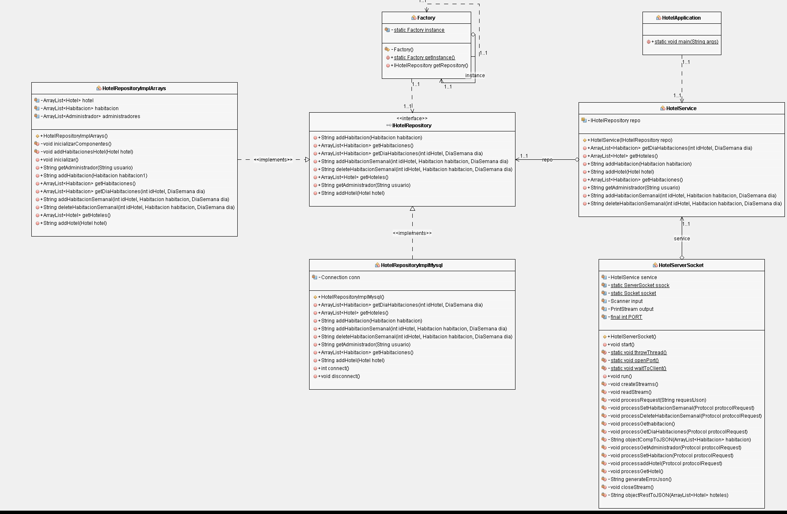
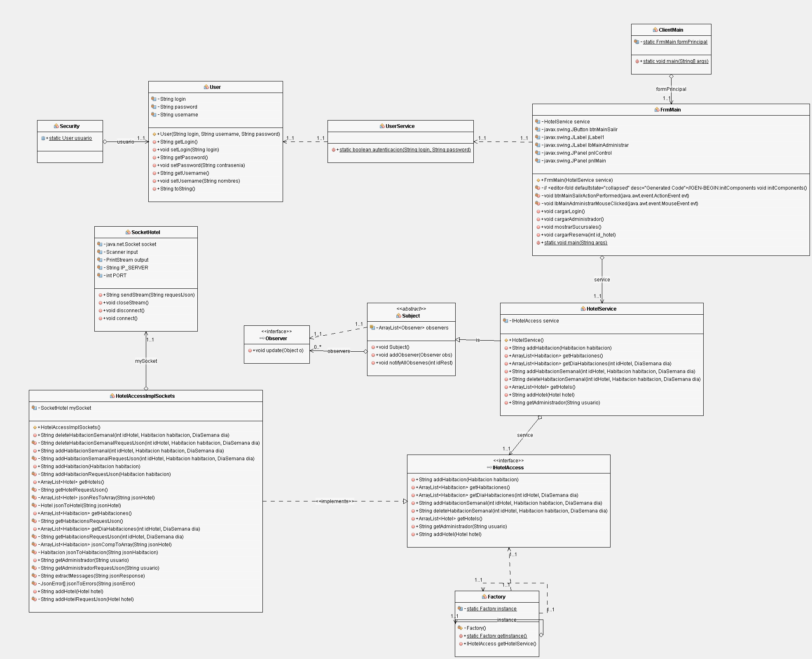
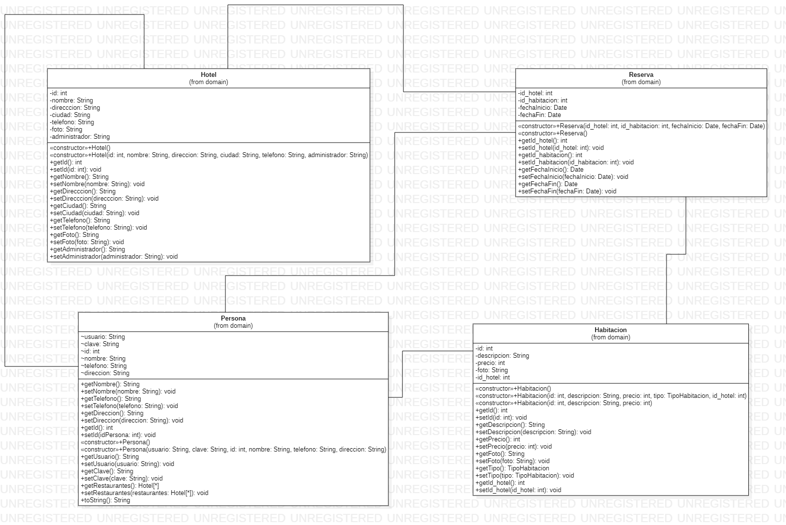

# RoomReserve
# MVP2.

El proyecto busca desarrollar una aplicación que permita a los  usuarios hacer una reservación en un hotel deseado a una de sus habitaciones disponibles . La aplicación permitirá llevar el control de los Diferentes hoteles, de las habitaciones, el pago y la gestión de estas mismas y así poder prestar un mejor servicio para el usuario final y el administrador llevar mejor un informe semanal y mensual de sus servicios. 
El sistema inicialmente brindará apoyo en los siguientes procesos:
* Visualizar habitación: El usuario (visitante, cliente y administradores) podrá consultar las características y disponibilidad.
* Reservar habitación: Un usuario cliente después de haber seleccionado la habitación acorde a sus necesidades, puede generar una reserva de la misma estableciendo el medio de pago siempre y cuando la habitación se encuentre disponible en las fechas seleccionadas.
* Adicionar habitación: Un administrador podrá realizar la inserción de una habitación a su Hotel.
* Adicionar sucursal:  Un administrador Master podrá realizar la inserción de una nueva sucursal.
* Visualizar sucursal: El usuario (Cliente,  Adm junior y  master) y visitantes podrán consultar las características del hotel.
*  Modificar habitación: El administrador master y junior podrá modificar la información de la habitación.
* Agregar administrador junior a un hotel: El administrador master podrá modificar el administrador junior asignado a una sucursal.
* Login master: El administrador master podrá iniciar sesión.  
* Login junior: El administrador junior podrá iniciar sesión.  
* Login cliente: El cliente podrá iniciar sesión.
* Crear cliente: Visitante podrá crear un usuario cliente para poder reservar habitaciones.
* Crear administrador junior: El administrador master podrá crear un usuario administrador junior.

# Componentes
● Vista de componentes y conectores(uml)

# REPRESENTACIÓN DE LA ARQUITECTURA. 
La arquitectura está representada por diferentes vistas utilizando Modelo C4 Y UML, con el fin de visualizar y entender mejor la arquitectura del sistema.La arquitectura utilizada fue la de cliente-servidor por medio del estilo arquitectónico de capas este estilo nos da un desacoplamiento de las partes que componen el sistema, gracias a esto se facilitará agregar o modificar algún componente debido al modularidad del proyecto evitando los errores de funcionalidad. También se realizó la separación de roles (administrador, hotel, cliente).

# MODELO DE CONTEXTO(C4).

# VISTA DE CONTENEDORES Y COMPONENTES(C4)

# VISTA DE MÓDULOS (UML).
VISTA DE SERVER.

VISTA DE CLIENTE.

# VISTA DE IMPLEMENTACIÓN(MAVEN,UML).

# VISTA DE INSTALACIÓN(Allocation, UML).

# DIAGRAMA DE CLASES (UML).
HOTEL-SERVER

HOTEL-CLIENTE

HOTEL-COMMONS

Untitled Diagram-Instalacion.drawio.png
# VISTA DE DATOS (MODELO ENTIDAD-RELACIÓN).

# DIAGRAMA DE SECUENCIA(UML).
RESERVAR              

LOGIN              

AGREGAR HABITACION           

# RESUMEN DE LAS DECISIONES DE ARQUITECTURA Y SU JUSTIFICACIÓN.
Para esta aplicación se ha optado por una aplicación de escritorio con posible migración (en un reléase superior) a aplicaciones móviles o web – Tomando como opción  idónea la solución "Cliente - Servidor" para la primera iteración, esto debido a que solución "Cliente - Servidor" posee grandes ventajas que ayudarán al desarrollo de esta aplicación, como lo es el facilitar la integración con otros sistemas (característica necesaria para los pagos en línea, el envío de mensajes vía email y la utilización del GPS), además de garantizar una modularidad y escalabilidad del sistema (buscando ampliar las funcionalidades y aportar valor al cliente en cada iteración).Por su parte, como decisión de lenguaje de programación para trabajar, el equipo se inclina hacia el uso de "Java" debido a que, además de ser uno de los lenguajes más populares hoy en día, de acuerdo con el TIOBE índex, el cual se puede encontrar en el siguiente enlace: https://www.tiobe.com/tiobe-index/, es un lenguaje de fácil comprensión, seguro y permite ser compilado en cualquier plataforma (gracias a la máquina virtual de Java "JVM"), otorgando al equipo y al producto final, el poder acoger una mayor cantidad de clientes (Clientes usuarios de Windows, clientes usuarios de Linux, clientes usuarios de MacOS, entre otros. Ademas la Tecnología multi-thread & sockets tcp: Esto nos permite recibir múltiples peticiones sin que el servidor colapse.Api swing java:nos permite crear interfaces gráficas las cuales son visualizables para el cliente, además favorece la usabilidad, y Mysql: Nos permite el registro de datos requeridos por la aplicación,incluyendo las búsquedas 

